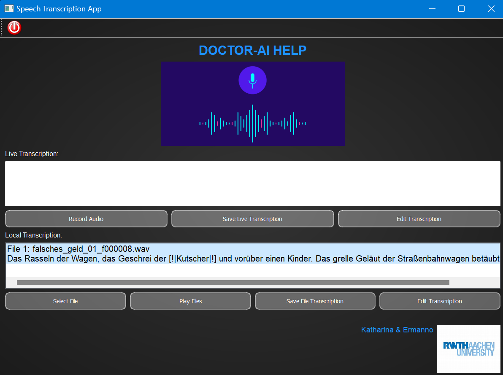

## DOCTOR-AI HELP GUI



### Description

The **Doctor-AI Help GUI** is a tool designed to assist doctors in evaluating transcriptions of audio recordings. This graphical user interface allows users to view, modify, play, and save transcriptions. It supports both local file transcriptions and live transcription from recorded audio. The GUI integrates features for recording audio, editing transcriptions, and saving them in appropriate directories.


### Features
- **Live** Transcription:
	- Click Record Audio to start recording. Click again to stop.
	- Save Live Transcription: Save the live transcription to a text file.
	- Edit Transcription: Edit the live transcription text.
- **Local** Transcription:
	- Click Select File to choose audio files for transcription.
	- Play Files: Play selected audio files.
	- Save File Transcription: Save transcriptions of selected files to individual text files.
	- Edit Transcription: Edit transcriptions of selected files.

	.
	├── GUI/

	│   ├── GUI_Controller.py      
	│   ├── GUI_Transcriber.py         
	│   ├── Audio_recorder.py        
	│   ├── Recording_Popup.py
    
	|── img/                       
	│   │   ├── background.png      
	│   │   ├── doctor-ai-help.png    
	│   │   └── exit.png
            
	├── main.GUIpy                    
	├── requirements.txt       
	└── README.md                

### Setup

1. **Clone the Repository**
    ```sh
    git clone https://git-ce.rwth-aachen.de/teamdb/speech-to-text.git
    cd speech-to-text
    ```
   
2. **Install Dependencies:**
    ```sh
    pip install -r requirements.txt
    ```
	
3. **Download Required Models:**
	Download the Vosk model suitable for your language from the Vosk models page: https://alphacephei.com/vosk/models.
	Ensure the model path is correctly set in the GUI_Controller.py file.

4. **Run**
    ```sh
    python mainGUI.py
    ```    
-----------------------------------------------------------------------------
## VOSK INFERENCE

To compute the average Word Error Rate (WER) of the Vosk model on a random audio folder of your dataset, follow these steps:

1. **Setup Audio Folder:**
   Prepare a folder containing audio files for transcription.

2. **Run Inference:**
   Modify the script in `main_testing_vosk.py` to point to your audio folder.
   Run the script to calculate the average WER.

3. **View Results:**
   The script will output the average WER of the Vosk model on your audio dataset.

#### Contributions

Contributions are welcome! Fork the repository, make your changes, and submit a pull request.

#### License

This project is licensed under the MIT License. See the LICENSE file for details.

